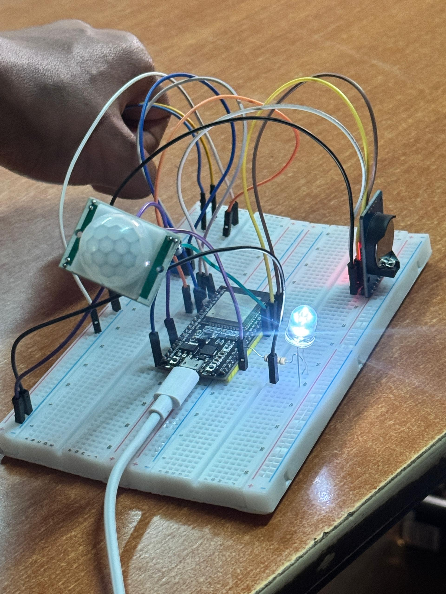

# 🌃 Smart Streetlights with Energy Saving

## 📘 Project Overview
This project, developed by **Group 22** for the **Embedded Systems** course, aims to create an energy-efficient street lighting system that adapts to ambient light conditions and human activity levels.

Unlike traditional streetlights that operate on fixed schedules, our **Smart Streetlights System** dynamically adjusts based on environmental lighting and motion detection — reducing energy waste and improving public safety.

---

## 🛑 Problem Statement

Traditional street lighting systems suffer from several inefficiencies:

- **Fixed Schedules**: Lights operate on time-based triggers, regardless of actual daylight conditions.
- **Constant Brightness**: Lights remain at full intensity even when no activity is present.
- **Inflexible Operation**: Inability to adapt to weather-related darkness (e.g., storms, overcast skies).

---

## 💡 Proposed Solution

Our Smart Streetlights system addresses these inefficiencies using:

- **Ambient Light Sensing**: Activates/deactivates lights based on measured darkness, not time.
- **Motion Detection**: Dims lights when idle, and increases brightness upon detecting motion.
- **Real-Time Clock (RTC)**: Maintains accurate time-based logic to complement environmental inputs.

### System Priorities:
- Illuminate only when necessary.
- Save energy during inactivity.
- Ensure visibility and safety when motion is detected.

---

## 🔧 System Features

- **Light Sensors**: Detect ambient light to determine light activation.
- **Motion Sensors**: Detect movement and adjust brightness accordingly.
- **RTC Module**: Keeps real-time track of night/day periods.
- **Energy Efficiency**: Minimizes power usage by dimming or switching off lights.
- **Adaptive Operation**: Reacts to real-world conditions like dark days or fog.

---

## 📟 How to Run the Code

1. **Connect ESP32** to your computer via USB.

2. **Open Arduino IDE**, and load the `.ino` file from the cloned project folder.

3. **Select the correct board and port**:
   - Go to **Tools → Board → ESP32 Dev Module**
   - Go to **Tools → Port**, and select the correct **COM port**.

4. **Verify the code**:
   - Click the ✅ **checkmark** in the toolbar to compile.

5. **Upload the code**:
   - Click the ➡️ **arrow button** to upload the compiled code to the ESP32.

6. **Monitor Serial Output** (optional but helpful):
   - Go to **Tools → Serial Monitor** to view real-time sensor readings and logs.

7. **Power and connect the hardware**:
   - Connect LDR, PIR, RTC, and LED circuit as per your wiring diagram.
   - If you plan to disconnect USB, ensure a stable **5V power source** is used to power the ESP32.

---

## ⚠️ Notes

- System only activates lighting control between 17:00 and 07:00 based on DS3231 RTC.
- LED brightness increases when motion is detected, and decreases when no motion is sensed.
- LDR adjusts the LED intensity based on surrounding light.


## 👥 Group Members

| Name                          | Registration No.   | Student No.     |
|------------------------------ |--------------------|-----------------|
| Sekibaala Mark                | 24/U/11007/PS      | 2400711007     |
| Akello Lilian                 | 24/U/03142/PS      | 2400703142     |
| Asiimwe Isaac                 | 24/U/03765/PS      | 2400703765     |
| Namubiru Kirabo Bakyaita      | 24/U/1038          | 2400701038      |
| Namayanja Mary Prechard       | 24/U/09046/PS      | 2400709046     |

---

## 🚀 Getting Started

### 📋 Prerequisites

- **Hardware**:  
  - Microcontroller --ESP32  
  - Light sensor (LDR)  
  - Motion sensor (PIR sensor) 
  - RTC Module (DS3231)  
  - 10mm LED lights  
  - Power supply
  - Potentiometer
  - 100 ohms resistors

- **Software**:  
  - Arduino IDE 
  - Required libraries (Wire, RTClib.)

---

## 🖼️ System Overview Diagram




### 🔌 Installation

1. **Clone this repository**:
   ```bash
   git clone https://github.com/SekibaalaMark/Smart_StreetLights_with_Power_Saving.git
